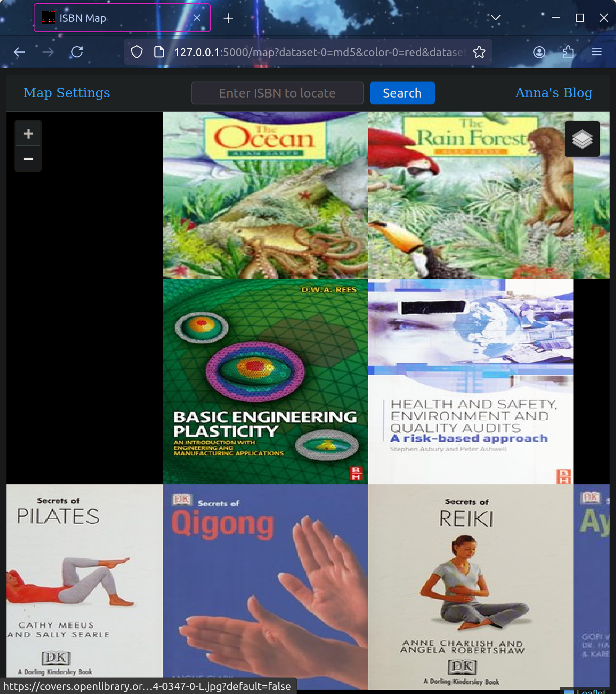

# ISBN Map - Smoothly Zoomable Map of ~2 Billion ISBNs
[Video](screenshots/ISBN_Map_Video_Tour.webm)

## Plan
To create a smoothly zoomable map of approximately 2 billion ISBNs.

## Problem
How to store and display a 2-gigapixel image.

## Idea
Use technology similar to digital map software, which allows users to zoom from a country-level view down to a street-level view.

## Execution
We leverage the open-source software **[Leaflet](https://leafletjs.com/)** to render a zoomable map in browsers on both desktop and mobile.  
Leaflet uses small 256x256 pixel "tiles" to load only the parts of the image where the user is zooming in.

### Overview
- Create a Flask application to serve Leaflet tiles.
- Tiles are generated dynamically, saved to disk, and then served to the user.  
  - **Image format:** `.WEBP` for the smallest file size and lossless quality (important for pixel-perfect rendering).
- Multiple datasets can be viewed, mixed, and matched to compare.  
  - **Color channels:** Primary colors (red, green, blue) are used to differentiate datasets.
  - Layers are blended using Leaflet’s stacking capabilities, allowing users to toggle datasets via a layer selector.

### Tile Generation
- Tiles are created using **NumPy vector operations** for speed and efficiency.
- ISBN data is preprocessed and stored in `.npy` format to avoid rebuilding datasets on every run. This is handled by `build_datasets.py`.

### Goals
- Be able to run efficiently on low end hardware for both the frontend and serverside code
- Easy to understand and modify
  - Less than 100 lines of code per file

## File Descriptions

### Scripts
- **`build_datasets.py`**  
  Builds NumPy arrays from the raw data and saves them to disk. **(Run this first)**

- **`app.py`**  
  Main application script. Serves Leaflet tiles and HTML pages.

- **`get_tile.py`**  
  Logic for generating a tile from datasets.

- **`publisher_country_ranges.py`**  
  Logic for creating country and publisher overlay tiles.

## Hardware Requirements
- **Memory:** 16 GB recommended, 8GB minimum.  
- **Storage:**  
  - Dataset files: ~2.37 GB  
  - Optional tile cache: ~40 GB (estimated)  
- **CPU:** Modern x86/64 processor from the past 5 years.

## Software Requirements
- **Python:** Version 3.10  
- **Browser:** Must support JavaScript.

## Getting Started

### Setup Instructions
1. Open a terminal in the folder containing this README file.
2. Install required libraries:
   ```bash
   pip install -r requirements.txt
   ```
3. Prepare datasets for NumPy processing:
   ```bash
   python ./datasets/build_datasets.py
   ```
4. Start the application:
   ```bash
   python app.py
   ```

### Access the Application
After starting the application, open your browser and go to:  
[http://127.0.0.1:5000](http://127.0.0.1:5000)

Choose some datasets to get started with, for example 'md5' on red and 'ia' on green.
Press submit to go to the map view. Zoom in slowly while watching CPU/memory usage (tiles are being generated and cached during first run).

### Troubleshooting
If you see "Invalid ISBN or Metadata" on known books, this may be due to isbnlib not working correctly on recent python versions (3.13). Try running app.py with python 3.10

## Features
- **Flask Backend Only**
- **Smooth Tile-Based Zoom**  
  Explore ISBNs with smooth zoom functionality.
- **Dataset Controls**  
  Switch between datasets, toggle layers on/off, and adjust color channels.
- **Country and Publisher Overlays**  
  Visualize ISBN publisher regions or country-specific datasets.
- **Device Compatibility**  
  Works on both desktop and mobile browsers.
- **Advanced Search**  
  - ISBN locator with a search bar.
  - Search ISBNs on Anna's Archive and Open Library.
- **Visualization Enhancements**  
  - RGB color mixing for comparing datasets.
  - Book metadata, covers, and ISBN masks.
  - Sequential ISBN representations.
- **Optimized for Performance**  
  Fast, efficient, and simple.

Enjoy your exploration of the ISBN map! 🚀

## Gallery
- Program Start:

- Map Configuration Page:

- Zoomed Out:

- Zoomed In:

- Search Feature:

- Book Popup:

- Cover View:

- Country Overlay:

- Publisher Overlay:
